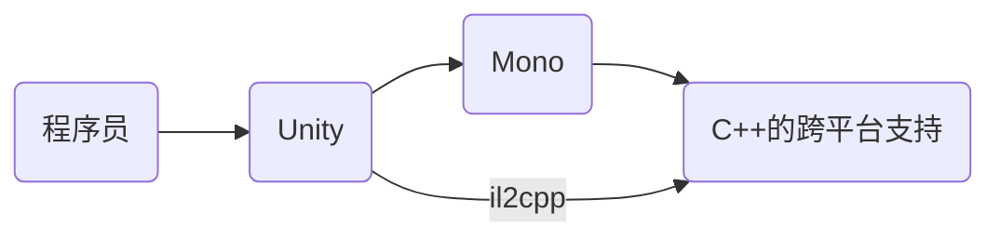
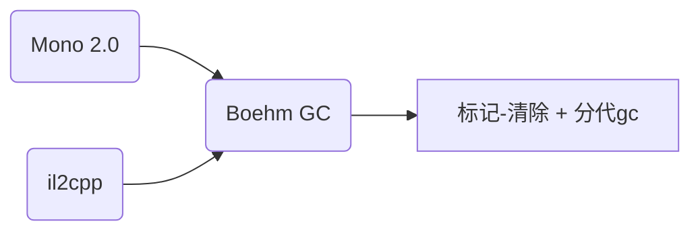

# Unity是如何跨平台的

## 一. Unity的跨平台方案

### 1. 前言：一些问题

* 1）Unity是如何支持C#、UnityScript、Boo等多种脚本语言的？
* 2）**CLI**、**CLR**、**IL**分别是什么？
* 3）Mono运行时和.NET运行时有何联系与区别？
* 4）什么是**AOT**，什么是**JIT**？
* 5）Mono存在哪些问题？Unity用来替代Mono的解决方案il2cpp是干什么的？

### 2. C++项目是如何跨平台的
cmake + ide:
* **Windows**: visual studio(MSVC)
* **Android**: android studio(NDK)
* **MacOS/IOS**: xcode(gcc)
几乎所有平台都对C++有良好支持，这一点是绝大多数项目跨平台的直接或者间接基础

### 2. 虚拟机(Virtual Machine)、运行时(Runtime)

* 字节码（opcode）、中间语言（intermediate language）
* 虚拟栈（JVM、CPython、CLR）
* 虚拟寄存器（Lua）

### 3. CLI、CLR和Mono

* **Common Language Infrastructure**（IronPython, C++/CLI, F#, C#, Boo）
* **Common Language Runtime**
* **Mono**是**CLI**的一个开源实现
* 推荐 **《CLR via C#》**

### 4. AOT与JIT

* Ahead Of Time(不需要运行时编译，无需runtime，启动快；无法产生新代码)
* Just In Time（运行时编译，可以根据平台架构、内存情况等优化代码，可以生成动态类型；有额外性能消耗，有安全性问题）

总体上来说JIT > AOT，只用AOT的话我为什么不用C++？

### 5.总结：跨平台需求的流转：

## 二. Unity中的垃圾回收

### 1. 常见gc算法

* 标记-清除算法(内存碎片)
* 标记-整理算法
* 引用计数法（循环引用导致内存泄漏, shared_ptr, weak_ptr）
* 复制算法
* 分代GC（与上面的可以结合使用）

### 2. Unity中的情况：

Unity2019: incremental GC（不需要在一帧里做完GC，减少GC峰值的卡顿感）

### 3. 优化GC很重要

* foreach(Mono的bug导致额外装箱，Unity 5.x已修复)
* linq表达式会有动态内存分配
* 尽量减少堆内存分配，减少装箱
* 避免帧内存分配
* 大量对象的产生与销毁要使用对象池

## 三. Unity的热更新方案

资源热更 -> AssetBundle

### 1. android平台的情况
在安卓平台Mono原生支持JIT，本身其实无需热更框架。简单改改mono源码即可在安卓上支持热更

### 2. ios平台的特殊情况
ios只能分配读写权限的内存，不能分配执行权限的内存。苹果本身也有审查政策，禁止App热更。因此在ios上mono禁用了JIT，反射有限制（不能动态创建新类型， 动态生成新代码），Mono虚拟机是无法用于热更新的。

### 3. 流行框架
* xlua, slua, ulua, tolua
* ILRuntime(为什么要套娃？)

可以通过反射和Unity交互，但是不能在热更新代码里新增类型。根本原因是Mono的`System.Reflection.Emit`在ios上不能使用。因此xlua里一般都要先打桩(stub)，未打桩的类无法热更。

## 四. Unity资源加密

* 1. AssetBundle加密
* 2. Assembly-CSharp.dll加密
* 3. libmono.so, libil2cpp.so加密
* 4. 程序加壳、反调试
* 5. 热更代码加密（opcode混淆与修改）