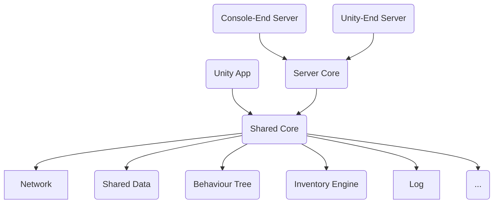

## 前言

哈喽，好久没有更新博客了!
这次是介绍一下我的兴趣项目：一个Unity客户端 + \.net服务器的游戏框架： **Neo** <br/>
Neo暂未开源（主要是考虑到很多第三方的版权问题）
但是我会在这篇文章中介绍详细的技术路线以及demo展示，有问题也可以留言联系我！让我们开始吧~

### 1. 总体架构

<!--- 去掉“--\>”里的反斜杠时mermaid diagram生效：
```mermaid
graph TD
A(Client Core) --\> B(Shared Core)
C(Server Core) --\> B(Shared Core)
D(Console Server) --\> C
E(UnityEnd Server) --\> C
F(UnityEnd Client) --\> A

B --\> Network
B --\> SD(Shared Data)
B --\> BT(Behaviour Tree)
B --\> IE(Inventory Engine)
B --\> GE(Grid Engine)
B --\> ETC(...)
```
-->

Neo是我这两三年来的一个兴趣项目，我的初衷是在这个项目里集成各种好用的第三方技术和第三方插件，让它变成一个“百宝箱”，能在我遇到问题时拿来即用。随着不停地迭代和进化，Neo的基础功能越来越完善，越来越好用，某些模块甚至好过我参与的商业项目。我想主要原因可能是这是由我一个人开发的，思路不会有团队协作时的混乱感，比较方便做相性更好的技术选型。因此我渐渐想把它往更完善的方向去发展，看看自己到底能走多远。



正如上图所示，Neo是C/S双端架构，客户端和服务器都使用C#语言开发。这样设计有一个好处，就是客户端和服务器很容易就可以共用代码。在Neo里，我把共用代码放到一个叫作`Shared Core`的csproj，Unity客户端和`Server Core`都依赖于这个工程生成的dll。在`Shared Core`里有网络框架、背包引擎、C-S共用数据模型、日志、行为树、状态机、Math等模块。<br/>
我将服务端的部分抽出成一个`Server Core`的csproj，然后构建目标也是一个dll，最后ConsoleApp去引用这个dll。这样做的目的是，将来如果有在Unity端运行本地服务器的需求，可以很方便地进行迁移。

### 2.技术细节

#### 2.1 共享程序集：Shared Core

共享的程序集是客户端和服务器都引用到的，因此只能有纯C#逻辑，而不能使用Unity引擎的API。设计理念上，它的子模块需要遵循依赖倒置原则（DIP），子模块的运行不能依赖于外部的实例类，而是依赖于接口，通过事件与调用者通信。它的子模块如下：

* **Log**：客户端或服务器所有日志都通过这个模块进行，会在当前工作目录下根据日期和pid创建日志文件，写入日志会带有时间戳、调用模块、日志等级等信息。对于Unity来说，需要通过回调与Unity.Debug.Log桥接起来；对于服务器控制台程序，需要通过回调与Console.WriteLine桥接起来。这样Unity的控制台和服务端就都能显示日志了。我们的服务端日志大概长这样：


* **Util**：有一些基础设施适合放在shared模块，这样就不需要同时维护两份。例如：SingletonBase（单例基类）、ListExtension（列表的洗牌、随机采样等）、StringExtension（用正则表达式进行用户名/密码校验等）、Math（浮点数取整、lerp、定点数等）、Random（掷骰子、圆面随机、球面随机）、PerformanceGuard（用RAII的方式监控关键路径的运行时间）、CalculationEngine（字符串公式计算，Neo使用的是第三方库Jace\.Net）、EventCore（事件系统）

* **Shared Data**：客户端和服务器在数据定义上，也有一些共有部分。例如：客户端和服务端的共用配置表、客户端与服务端协议、客户端与服务端共用的DataModel。关于这一部分，后续的导表工具与网络模块会介绍更多细节。

* **Reflection**：擅用反射可以将你从繁琐重复的各种Register中解放出来。Neo中广泛使用反射进行事件监听。例如，服务端程序集里所有标记了`[REPLCmd]`(Read-Evaluate-Print-Loop)的static方法，都可以通过控制台的用户输入调用；Shared程序集里所有标记了`[UnitTest]`的static方法，都会在收到单元测试指令时运行一次；所有网络协议的处理函数注册，是通过反射进行的，例如登录协议的处理函数，需要标记`[ProtocolHandler(typeof(Req_Login))]`；服务端收到客户端的GM协议时，会查找对应的标记`[GMCmd]`的函数并分析函数签名，决定是否执行。<br/>
下面这个例子展示了反射模块的单元测试：

``` C#
[TheTestFunc]
public static void TestFunc(int x, string y)
{
    Neo.Log($"TestFunc, x={x}, y={y}");
}

[UnitTest]
private static async void _RunReflectionTest()
{
    await ReflectionUtil.PreloadMethodsFromAssembly(new List<string>
    {
        "Neo.Shared",
        "Neo.Server.Core",
    });

    using (var utg = new UnitTestGuard("ReflectionUtil"))
    {
        Dictionary<string, MethodInfo> methodMap;
        using (var utg1 = new UnitTestGuard("ReflectionUtil-LoadMethods"))
        {
            methodMap = ReflectionUtil.GetMethodsMapWithAttribute<TheTestFuncAttribute>(new List<string> { "Neo.Shared" });
        }
        using (var utg2 = new UnitTestGuard("ReflectionUtil-CallMethods"))
        {
            ReflectionUtil.TryInvokeMethodFromCmdString(methodMap, "TestFunc 12345 Hello");
        }
    }
}
```

* **BehaviourTree**：

* **InventoryEngine**：


#### 2.2 Unity客户端

#### 2.3 .net服务端

#### 2.4 网络通信

### 3.一个实例-背包系统

