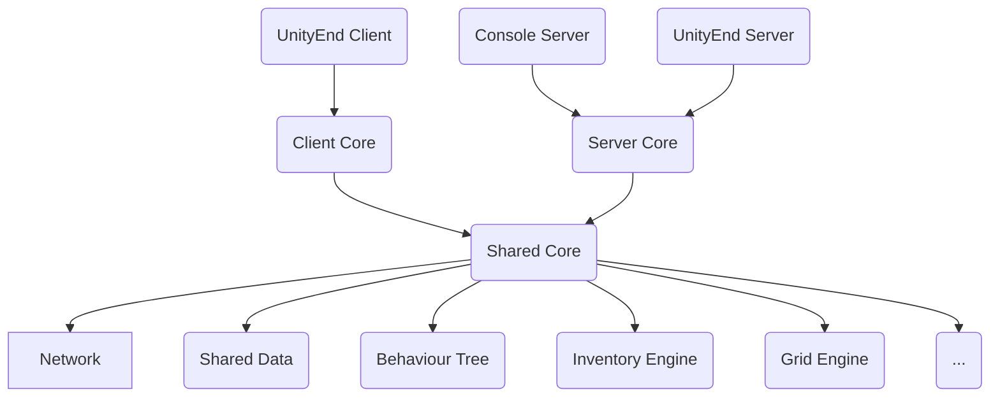

## 前言

哈喽，好久没有更新博客了!
这次是介绍一下我的兴趣项目：一个Unity客户端 + \.net服务器的游戏框架： **Neo**
Neo暂未开源（主要是考虑到很多第三方的版权问题）
但是我会在这篇文章中介绍详细的技术路线以及demo展示，有问题也可以留言联系我！让我们开始吧~

### 1. 总体架构

<!--- 去掉“--\>”里的反斜杠时mermaid diagram生效：
```mermaid
graph TD
A(Client Core) --\> B(Shared Core)
C(Server Core) --\> B(Shared Core)
D(Console Server) --\> C
E(UnityEnd Server) --\> C
F(UnityEnd Client) --\> A

B --\> Network
B --\> SD(Shared Data)
B --\> BT(Behaviour Tree)
B --\> IE(Inventory Engine)
B --\> GE(Grid Engine)
B --\> ETC(...)
```
-->

Neo是我这两三年来的一个兴趣项目，我的初衷是在这个项目里集成各种好用的第三方技术和第三方插件，让它变成一个“百宝箱”，能在我遇到问题时拿来即用。随着不停地迭代和进化，Neo的基础功能越来越完善，越来越好用，某些模块甚至好过我参与的商业项目。我想主要原因可能是这是由我一个人开发的，思路不会有团队协作时的混乱感，比较方便从更高维度上去做技术选型。因此我渐渐想把它往更完善的方向去发展。
它是C/S双端架构，其中客户端和服务器都是基于C#

